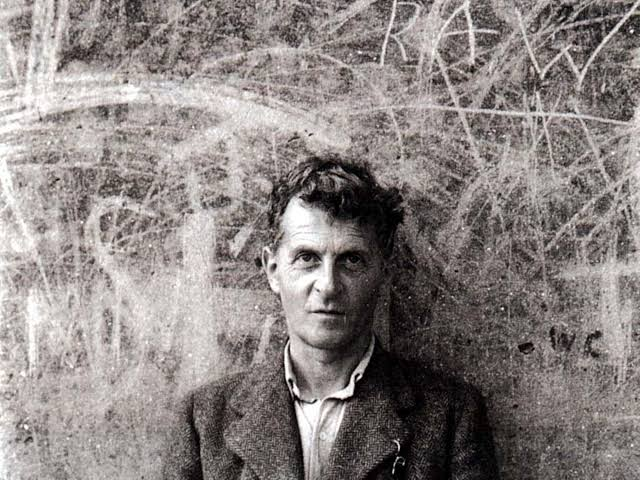

Nishant's Profile
=================

## About me

  
I am **Nishant Kumar Singh**, a rising junior at IIT Goa, majoring in Computer science and Engineering.  
I am interested in Computer Science and Math, specifically Graph theory and Finite group theory, Field theory.

## Education

| Sr. no.  | Academic Year   | Standard      | School  |
|----------|-----------------|---------------|---------|
|    1.    |  2009-2019      |  1-10         | AFS     |
|    2.    |  2019-2021      |  11-12        | KV      |
|    3.	   |  2021-          |  1st-2nd year | IIT Goa 

## Courses
This is a comprehensive list of courses I took in 4th semester
- **CS212**
	- Computer Networks
	- *Prof. Neha Karanjkar*
	- [Course Page for CS 212](https://nehakaranjkar.github.io/cs212.html) 
- **CS211**
	- Computer Architecture
	- *Prof. Sharad Sinha*
- **ID601**
	- Numerical Simulation
	- *Prof. Mantu Santra* and *Prof. Santosh Kumar Das*

- **CS222**
	- Algorithm Design
	- *Prof. Rahul C. S.*
- **CS102**
	- Software tools
	- *Prof. Clint P. George*
	- [Course Page for CS102](https://clintpgeorge.github.io/cs-102/spring-2023/)
	
## Hobbies and Interests

Some of my hobbies are   

1. Gaming

    I specifically like the games, CSGO, Dota 2 and League of Legends.

2.  Coding

    I code daily on Leetcode and you can find me on the contest rankings of Codechef and Codeforces every once in a while.

3. Reading History books

    I suggest reading Vodka Politics: Alcohol, Autocracy, and the Secret History by Mark Lawrence
 
Some of my interests are

1. Math

    I would like to read geometric graph theory when I do get the time, currently I am reading Galois theory from Dummit and Foote

2. Theretical Computer Science

    I am reading D.B. West to get better at graph theory in CS.

3. Philosophy specifically Ludwig Wittgenstein's work

    Here's a  picture of my favorite Philosopher   
    

4. Garage music	- a genre I like
